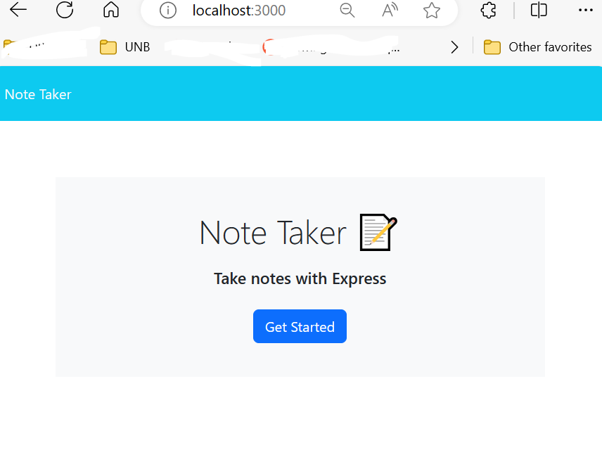

# PENDING TO UPDATE bootcamp2023-Challenge10-SVGLogoGenerator

 

    
    

 

## Description

Object-oriented Programming Challenge: SVG Logo Maker

<b>User Story:</b> 
AS a freelance web developer  
I WANT to generate a simple logo for my projects 
SO THAT I don't have to pay a graphic designer 

## Table of Contents

- [How to install](#installation)
- [How to use](#instruction)
- [License](#license)
- [Contributions](#contributions)
- [Tests](#testing)

## How to install
You can install this readme by cloning this repository in your terminal with the following url: https://github.com/MSabaO/bootcamp2023-Challenge10-SVGLogoGenerator. Once completed, type "npm init -y" in the console to install the node packages.  
step by step
npm init -y
npm install

### Walkthrough Video
https://drive.google.com/file/d/1rloCU8EN1KchGI3Da3oz9DfEQgYKwPQr/view
Test video 
https://drive.google.com/file/d/1wmtY4sRh2E6LXwcbUriBvV4ldI7I8ppi/view

## Usage
Once installed, open your terminal and navigate into the folder of this app "bootcamp2023-Challenge10-SVGLogoGenerator". Write in the terminal "node index.js", and you will see the questions prompting one by one, answer them and press enter. The app will show a message when it is finished. 
 
<b>Screenshot of the questions</b>

## Contributions
Contributions are welcome! If you'd like to contribute to the project, follow these steps:

1.    Fork the repository.
2.    Create a new branch for your feature or bug fix.
3.    Make your changes and commit them.
4.    Submit a pull request.

To contact me, feel free to reach out through my github profile mentioned below.

## Test
N/a

## Author
Hi, I'm MSabaO! The author of this application. You can see all my projects in my repository at https://github.com/MSabaO

My email: test-gmail@gmail.com

## License 
  

This application is covered under MIT License. See the [LICENSE][MIT] file for details.
